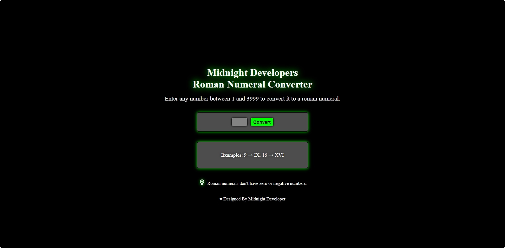

# 🔢 Midnight Developers Roman Numeral Converter

## 📖 Overview
This project was part of my FreeCodeCamp JavaScript Algorithms and Data Structures certification curriculum. Where I built a Roman Numeral Converter using HTML, CSS, and JavaScript. The project was created to practice JavaScript algorithms, conditional logic, and string manipulation, while also reinforcing my HTML and CSS skills for building the interface. 

The Roman Numeral Converter allows users to input a number and see its equivalent Roman numeral representation, and vice versa. It is a web-based application that converts numbers between Arabic numerals (e.g., 1, 2, 3) and Roman numerals (e.g., I, II, III). It was a great exercise in DOM manipulation and implementing conversion algorithms.

## ✨ Features
- Convert Arabic numbers (1–3999) into Roman numerals.
- Input validation to prevent invalid numbers.
- Simple, user-friendly design with HTML and CSS.
- Interactive functionality powered by JavaScript.

## 🛠️ Built With
- HTML – structure
- CSS – styling
- JavaScript – logic and interactivity

## 🚀 How to Use
[`View Project`](https://midnight-developer-ts.github.io/midnight-developers-roman-numeral-converter/)

1. Enter a number between 1 and 3999.
2. Press convert to convert the number.
3. See it converted instantly to a Roman numeral.
4. clear input to start over.

## 🔍 Example Usage
`Input: 36`
`Output: XXXVI`

`Input: XLIV`
`Output: 44`

## 📂 Project Structure
midnight-developers-roman-numeral-converter/ `root folder`

│── index.html `main webpage`

│── css `styling folder`

│ └── style.css `styling`

│── img/ `image folder`

│ └── website-favicon.png `favicon`

│ └── website-preview.png `preview image`

│── js `javascript folder`

│ └── script.js `interactivity`

│── LICENSE `license details`

│── README.md `project details`

## 📌 Learning Goals
- Practice implementing algorithmic thinking in JavaScript.
- Strengthen knowledge of loops, conditionals, and object mappings.
- Build a small but functional project combining HTML, CSS, and JS.

## 🎯 Certification Compliance
This project fully meets all FreeCodeCamp JavaScript Algorithms and Data Structures 
Roman Numeral Converter user stories and requirements.

## 📸 Preview 

[`View Project`](https://midnight-developer-ts.github.io/midnight-developers-roman-numeral-converter/)

## 📄 License 
This project is provided for portfolio and educational review only. 
Copying, redistribution, or commercial use is prohibited. 

This project is licensed under a Midnight Developer Proprietary License. 
See the [LICENSE](https://github.com/Midnight-Developer-ts/midnight-developers-roman-numeral-converter/blob/main/LICENSE) file for full terms.
